<!-- Remova as tags <style> e aplique o CSS inline nos elementos necessários, pois o GitHub não processa <style> em markdown. -->

<!DOCTYPE html>
<html lang="pt-BR">
   <head>
      <meta charset="UTF-8" />
      <meta name="viewport" content="width=device-width, initial-scale=1" />
   </head>
   <body>
      

         
         
<strong>Lucas Félix</strong> (Desenvolvedor Full-Stack)

      

      <h3>Tecnologias que trabalho atualmente</h3>
      

         
      

      <h2>Repositório</h2>
      

         
      

      <h4 align="center">
         O objetivo deste repositório <strong>Git</strong> é apresentar os projetos que estou desenvolvendo na universidade, com a finalidade principal de servir como uma ferramenta de estudo. Espero, ao longo desse processo, aprimorar minhas habilidades continuamente.
      </h4>
      <h2>Mini RPG 🎮</h2>
      

         Participei do desenvolvimento de um mini RPG em <strong>Java</strong> como parte da disciplina de Programação Orientada a Objetos. Buscamos aplicar os principais conceitos da programação orientada a objetos, além de explorar recursos como a exibição de personagens e de um mapa na tela, utilizando as bibliotecas padrão do <strong>Java</strong>.
      

      
<a href="https://github.com/IsacL21/ProjetoJogoMC322.git">Link do projeto</a>

      

         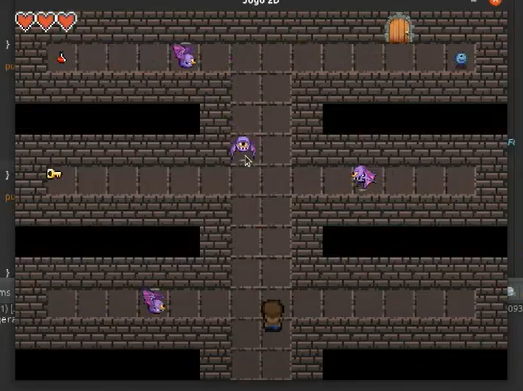
      

      <h2>Space Invaders para placas FPGA 👾</h2>
      

         Projeto realizado em <strong>Verilog</strong> usando placas <strong>FPGA</strong>. Aplicamos conceitos de lógica digital, Quartus, mapeamento de hardware, entre outros.
      

      
<a href="https://github.com/ic-unicamp/2024s1-mc613-projeto-tabajara-fc.git">Link do projeto</a>

      <h3>Tela de Início</h3>
      

         
      

      <h3>Tela do Jogo</h3>
      

         
      

      <h2>Projeto para Controle Financeiro 💸</h2>
      

         Site desenvolvido com <strong>HTML, CSS, JS, Flask</strong> e <strong>SQLite</strong> para gerenciamento de finanças pessoais.
      

      
<a href="https://github.com/nadas-t/Projeto_MC656.git">Link do projeto</a>

      <h3>Algumas telas do projeto</h3>
      <ul>
         <li>Tela de login</li>
         <li>Tela de criação de conta</li>
         <li>Tela principal da aplicação</li>
         <li>Tela de adição de receitas</li>
         <li>Tela de leitura de dicas de economia</li>
         <li>Tela de troca de senha</li>
         <li>Tela de adição de gastos</li>
      </ul>
      

         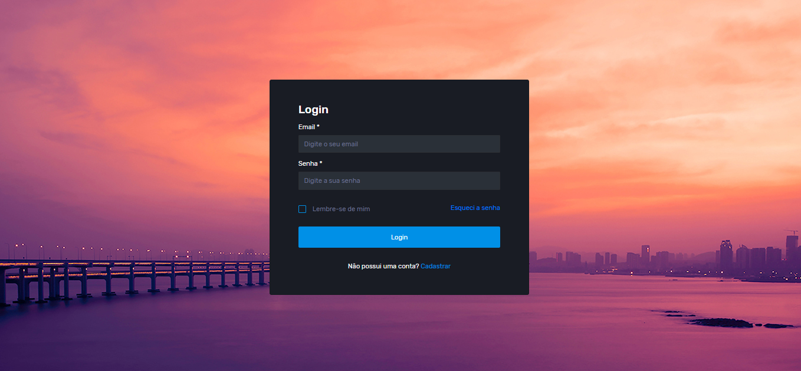
         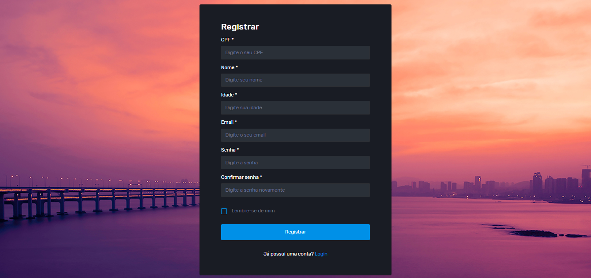
         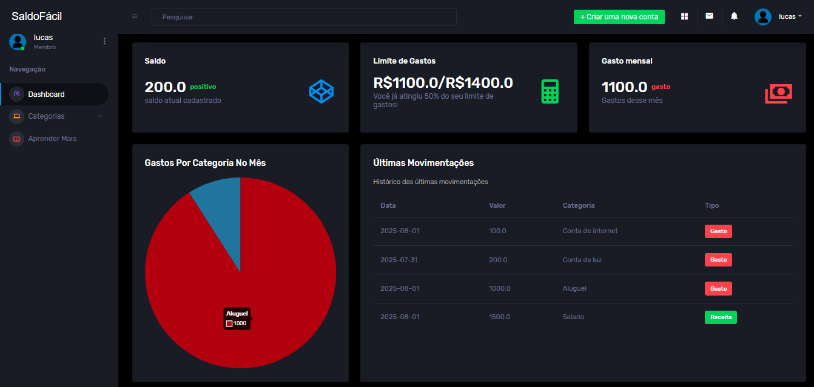
         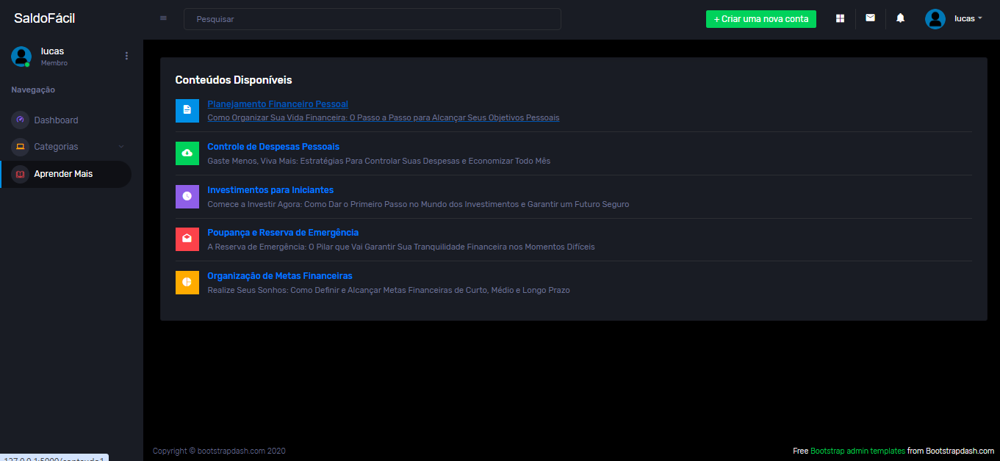
         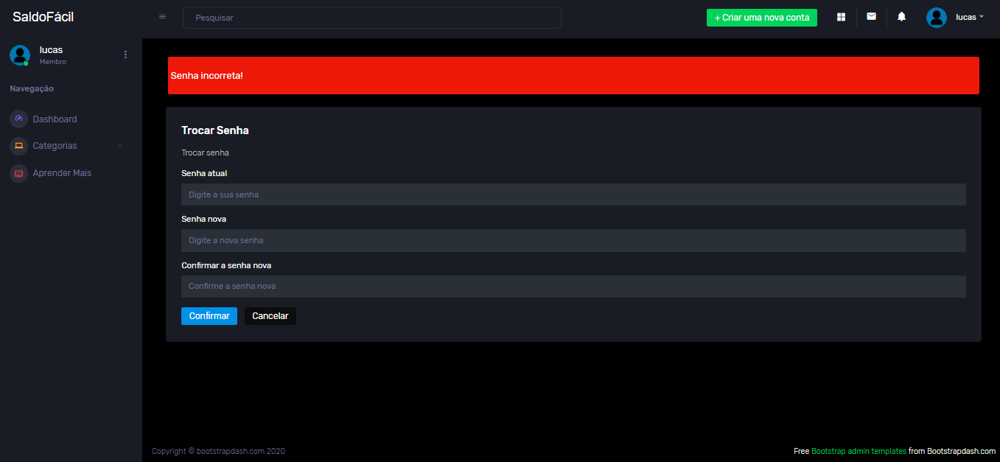
         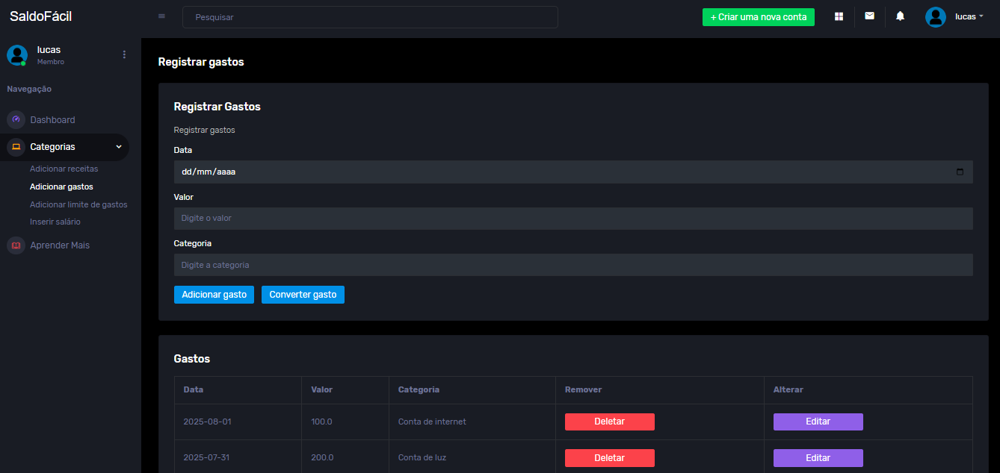
      

      <h2>Projeto de IA para Previsão de Chuva 🤖</h2>
      

         Projeto de comparação entre modelos de previsão de chuva usando dados do BDQueimadas.
      

      
<a href="https://github.com/IgorEBatista/MC906_ForestBurning.git">Link do projeto</a>

      <h3>Modelos utilizados</h3>
      <ul>
         <li>Regressão Logística</li>
         <li>Random Forest</li>
         <li>Deep Learning</li>
      </ul>
      <h4>Resultados: Regressão Logística</h4>
      

         
         
         
      

      <h4>Resultados: Random Forest</h4>
      

         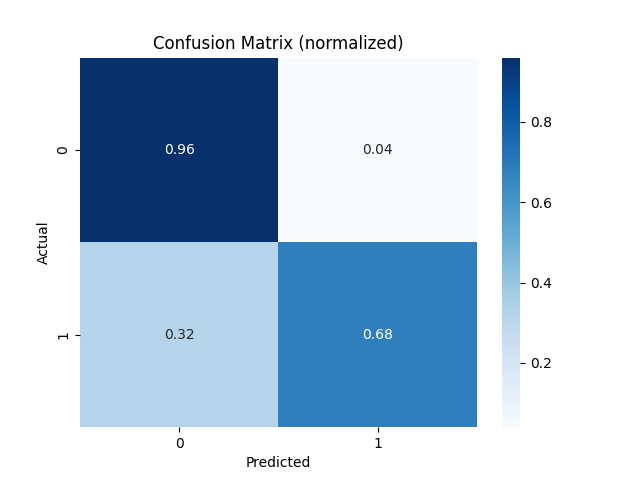
         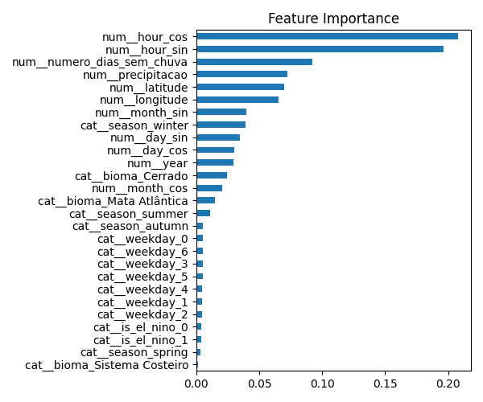
         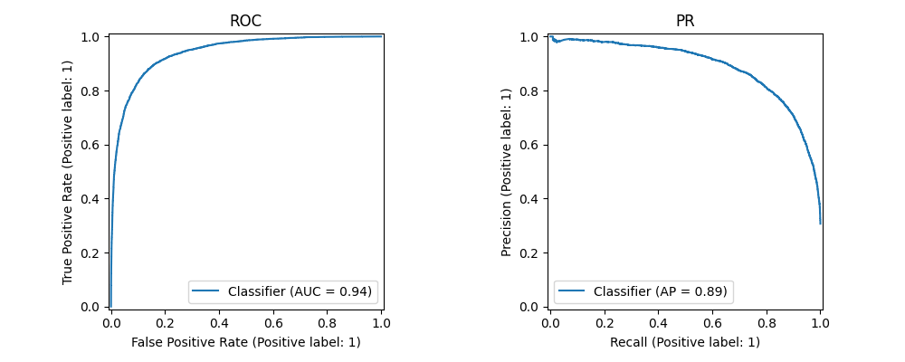
      

      <h4>Resultados: Deep Learning</h4>
      

         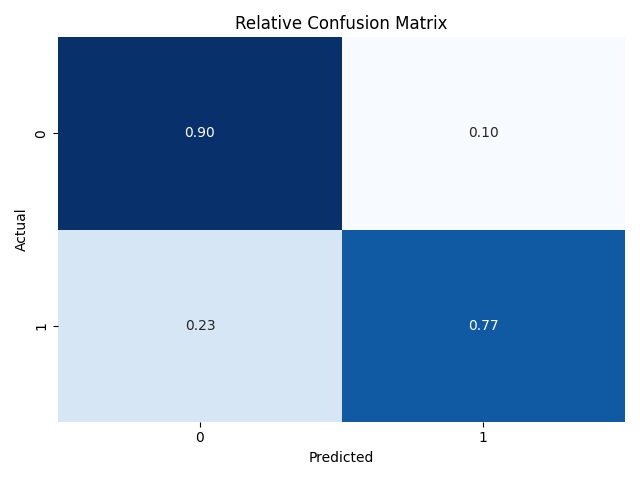
         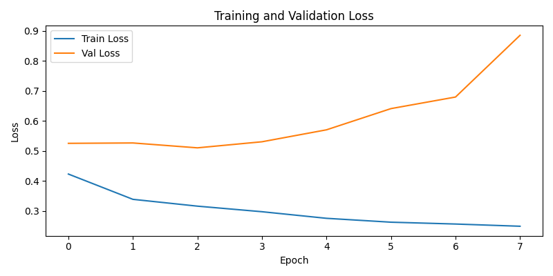
         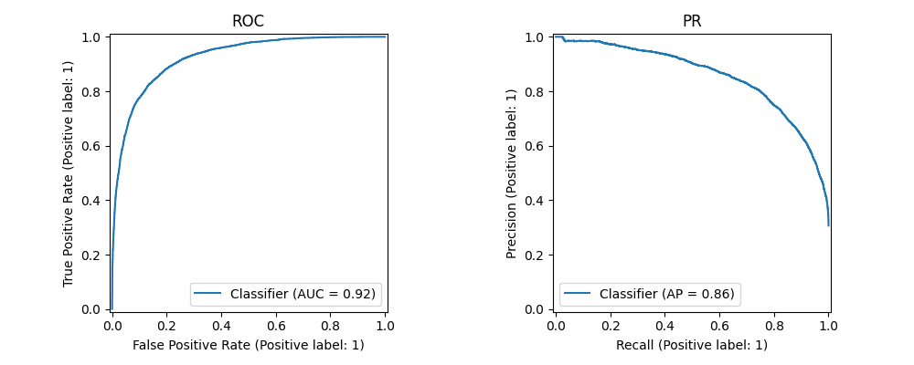
      

      <h2>Trabalhos sobre Processamento de Imagens 🖼️</h2>
      

         Trabalhos realizados na disciplina MC920 com <strong>NumPy</strong> e <strong>scikit-image</strong>.
      

      
<a href="https://github.com/lfelix466/Introducao-Processamento-de-Imagem-Digital.git">Link do projeto</a>

      <h3>Manipulações Gerais</h3>
      

         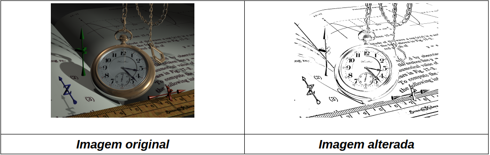
         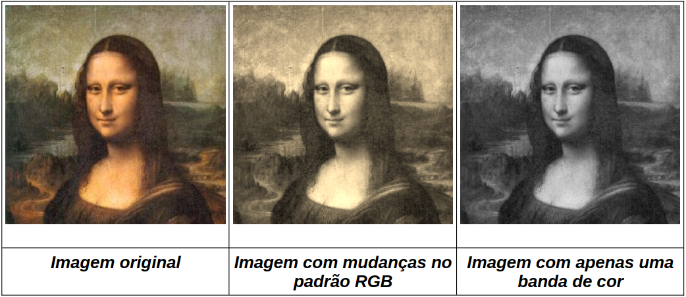
         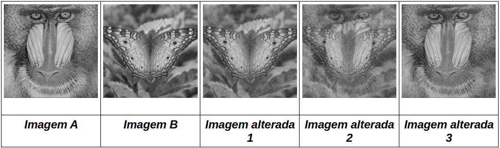
         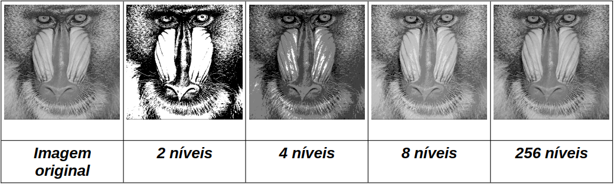
      

      <h3>Filtros e Compressão</h3>
      

         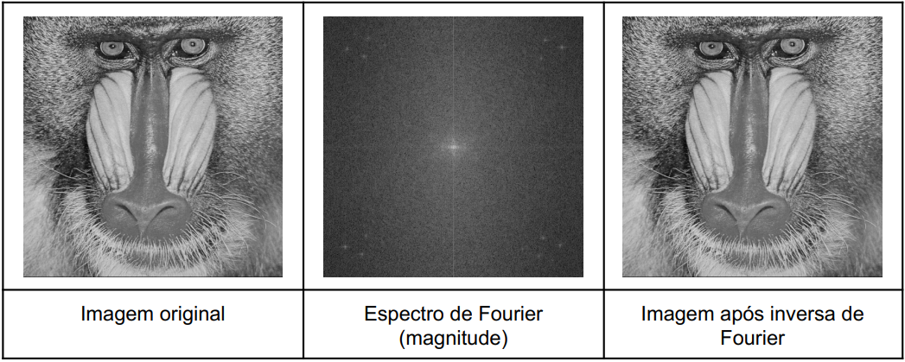
         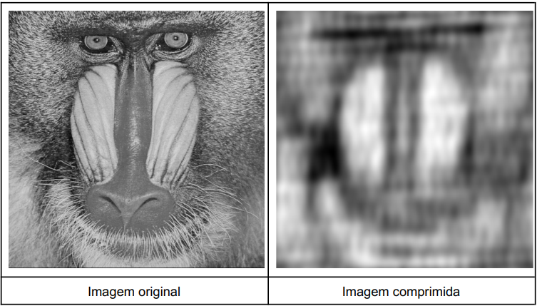
      

      <h3>Redirecionamento e OCR</h3>
      

         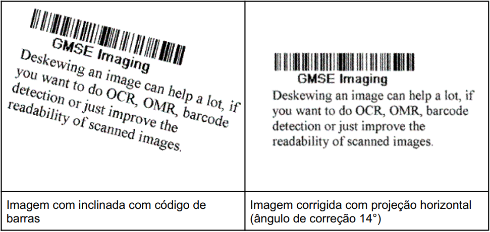
         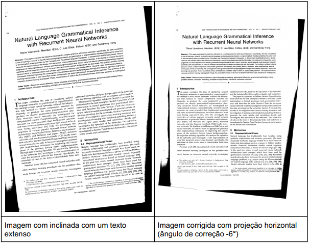
      

      <h3>Transformações de Escala e Coleta de Dados</h3>
      

         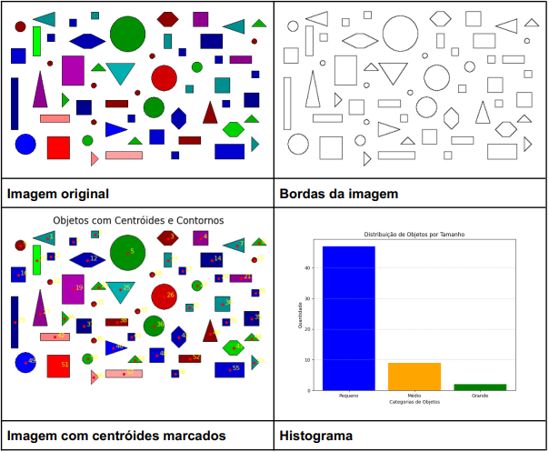
         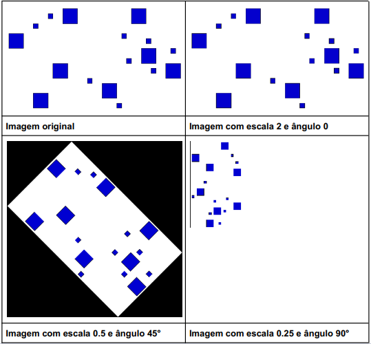
      

   </body>
</html>