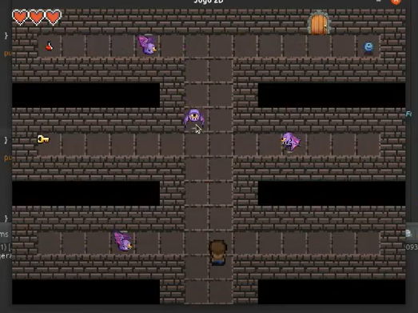
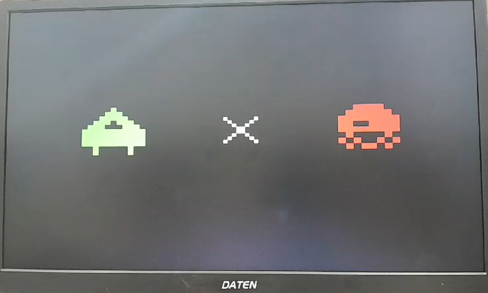
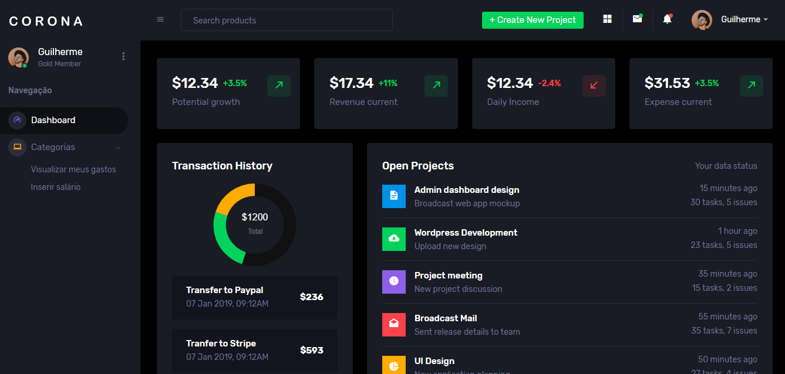

# Estudo  

O intuito deste repositório Git é criar os projetos que estou desenvolvendo na Universidade, tendo como principal objetivo ser uma ferramenta de estudo. Espero, com o tempo, aprimorar minhas habilidades ao longo desse processo.

# Projetos

## Mini RPG 🎮

Participei da criação de um mini RPG em Java para a disciplina de Orientação a Objetos. Tentamos aplicar os principais conceitos da programação orientada a objetos, além de explorar recursos como a exibição de personagens e um mapa na tela, utilizando as bibliotecas padrão do Java.

[Link do projeto](https://github.com/IsacL21/ProjetoJogoMC322.git)

## Space Invaders para placas FPGA 🎮

Participei da criação de um mini RPG em Java para a disciplina de Orientação a Objetos. Tentamos aplicar os principais conceitos da programação orientada a objetos, além de explorar recursos como a exibição de personagens e um mapa na tela, utilizando as bibliotecas padrão do Java.

[Link do projeto](https://github.com/ic-unicamp/2024s1-mc613-projeto-tabajara-fc.git)

### Tela de Início

### Tela do Jogo

## Projeto para ajudar no controle financeiro 💸

Atualmente, estou trabalhando em um projeto que consiste em um site para auxiliar as pessoas no controle financeiro, oferecendo simulações, gráficos, sugestões, entre outros recursos. O projeto ainda está em uma fase inicial e utiliza mais tecnologias do que os anteriores, como HTML, CSS, JavaScript, Python, Flask, SQLite e testes unitários. Além disso, o controle de versionamento é mais rigoroso em comparação aos projetos anteriores.

[Link do projeto](https://github.com/nadas-t/Projeto_MC656.git)

