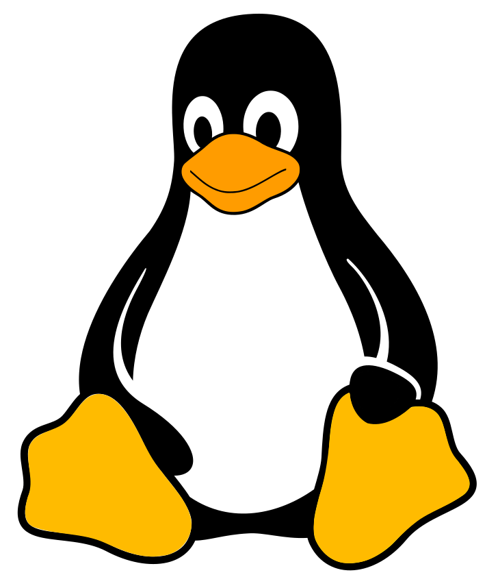

<!DOCTYPE html>
<html lang="pt-BR">
<head>
  <meta charset="UTF-8" />
  <meta name="viewport" content="width=device-width, initial-scale=1" />
  <title>Meu Portfólio</title>
  <link rel="stylesheet" href="css/style.css" />
</head>
<body>

<h1 align="center">
  

  

  Lucas Félix (Desenvolvidor Full-Stack)
  

</h1>

<h3>Tecnologias que trabalho atualmente</h3>

  

<h2>Repositório</h2>

  

<h4 align="center">O objetivo deste repositório <strong>Git</strong> é apresentar os projetos que estou desenvolvendo na universidade, com a finalidade principal de servir como uma ferramenta de estudo. Espero, ao longo desse processo, aprimorar minhas habilidades continuamente.</h4>

## Mini RPG 🎮

Participei do desenvolvimento de um mini RPG em <strong>Java</strong> como parte da disciplina de Programação Orientada a Objetos. Buscamos aplicar os principais conceitos da programação orientada a objetos, além de explorar recursos como a exibição de personagens e de um mapa na tela, utilizando as bibliotecas padrão do <strong>Java</strong>.

[Link do projeto](https://github.com/IsacL21/ProjetoJogoMC322.git)

## Space Invaders para placas FPGA 👾

Participei do desenvolvimento de uma versão do jogo Space Invaders em uma placa <strong>FPGA</strong>, utilizando a linguagem Verilog. O projeto foi realizado com base nos conhecimentos adquiridos na disciplina de Circuitos Digitais, exigindo a aplicação de conceitos de lógica digital, uso da ferramenta Quartus, configuração de geradores de clock e reset, além do mapeamento de hardware para utilização dos botões e pinos da placa.

[Link do projeto](https://github.com/ic-unicamp/2024s1-mc613-projeto-tabajara-fc.git)

### Tela de Início

### Tela do Jogo

## Projeto para ajudar no controle financeiro 💸

Projeto desenvolvido para a disciplina de Engenharia de Software. Trata-se de um site voltado para auxiliar usuários no controle financeiro, oferecendo recursos como simulações, gráficos, sugestões e outros. O sistema foi construído utilizando diversas tecnologias, incluindo HTML, CSS, JavaScript, Python, Flask, SQLite e testes unitários. Além disso, o controle de versionamento foi aplicado de forma mais rigorosa em comparação aos projetos anteriores.

[Link do projeto](https://github.com/nadas-t/Projeto_MC656.git)

### Algumas telas do projeto

- Tela de login
- Tela de criação de conta
- Tela principal da aplicação
- Tela de adição de receitas
- Tela de leitura de dicas de economia
- Tela de troca de senha
- Tela de adição de gastos

## Telas do projeto

  
  
  
  
  
  
  

# Projeto de Inteligência Artificial voltado para a previsão da possibilidade de chuva em determinada região 🤖

Este projeto foi desenvolvido para a disciplina de Introdução à Inteligência Artificial e tem como objetivo comparar diferentes modelos de IA na tarefa de prever a ocorrência de chuva, com base em dados como coordenadas geográficas, data, número de dias sem chuva, entre outros.
Para isso, foram utilizados dados do banco de dados Queimadas, com foco em informações do território brasileiro. Os dados passaram por um processo de limpeza e tratamento para permitir análises mais precisas.
Três modelos principais foram utilizados na comparação:

- Regressão Logística (modelo estatístico)

- Random Forest (modelo baseado em árvores de decisão)

- Deep Learning (modelo baseado em redes neurais)

[Link do projeto](https://github.com/IgorEBatista/MC906_ForestBurning.git)

# Bibliotecas principais utilizadas 📦

## Inteligência Artificial / Aprendizado de Máquina 🔮

- tensorflow – Framework de aprendizado profundo (Deep Learning).

- scikit-learn – Algoritmos de machine learning clássico (regressão, classificação, clustering).

- statsmodels – Modelagem estatística e econometria.

- joblib – Paralelização e serialização de modelos (frequentemente usado com scikit-learn).

- h5py – Armazenamento e leitura de grandes volumes de dados em HDF5 (usado com TensorFlow, por exemplo).

## Manipulação e Análise de Dados 🧮

- numpy – Computação numérica com arrays.

- pandas – Manipulação de dados tabulares.

- scipy – Ferramentas matemáticas e científicas.

## Visualização de Dados 📊

- matplotlib – Biblioteca de visualização padrão.

- seaborn– Visualizações estatísticas baseadas no matplotlib.

## Geolocalização e Dados Geoespaciais (caso o projeto envolva IA geográfica) 🌍

- geopandas – Extensão do pandas para dados geoespaciais.

- shapely – Manipulação de geometrias.

- rasterio, fiona, pyproj – Leitura, projeção e manipulação de dados geográficos.

- geopy – Geocodificação, cálculos de distância, etc.

## Imagens dos resultados gerados pelos dados do estado de São Paulo

Regressão logistica

  
  
  

Random forest

  
  
  

Deep Learning

  
  
  

## Trabalhos sobre manipulação de imagens 🖼️

Conjunto de trabalhos realizados para a disciplina de Introdução ao Processamento de Imagem Digital (MC920), utilizando Python e bibliotecas comuns para tratamento de imagens, como <strong>NumPy</strong> e <strong>scikit-image</strong>.

[Link do projeto](https://github.com/lfelix466/Introducao-Processamento-de-Imagem-Digital.git)

<h1>Manipulações gerais em imagens</h1>

Este trabalho teve como objetivo a manipulação de imagens utilizando conceitos básicos, como conversão para níveis de cinza, aplicação de filtros como o filtro gaussiano, combinação de imagens, criação de mosaicos, entre outros.

  
  
  
  

<h1>Aplicação de filtros no domínio da frequência e técnicas de compressão</h1>

Este trabalho teve como foco a aplicação de filtros conhecidos, como o filtro Burkes, a filtragem no domínio da frequência e a compressão de imagens.

  
  

<h1>Redirecionamento de imagens e reconhecimento de texto em imagens</h1>

Este trabalho consiste na correção de imagens rotacionadas e na identificação de textos presentes nas imagens, utilizando conceitos de projeções horizontais e a transformada de Hough.

  
  

<h1>Coleta de informações de objetos na imagem, além de operações de mudança de escala e rotação</h1>

Este trabalho consiste na aplicação de técnicas para identificação de dados de objetos em uma imagem, como área, perímetro e centróide, entre outros. Além disso, foram realizadas técnicas de transformações de imagens, como interpolação do vizinho mais próximo e interpolação bilinear, entre outras, para rotacionar e alterar a escala das imagens. 

  
  

</body>
</html>
